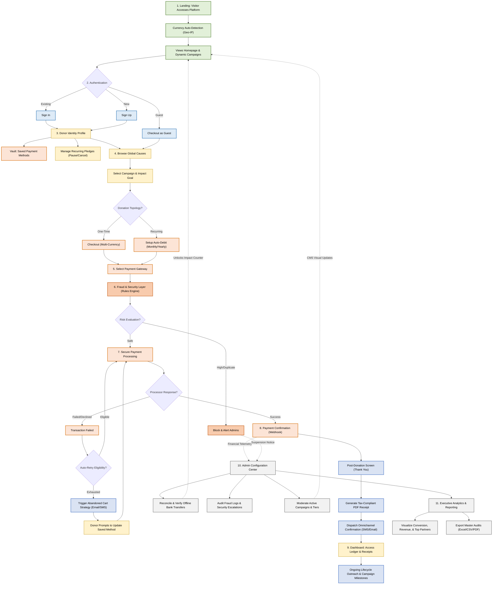

# Donor Activity Flow & Advanced System Architecture Guide
## Baitussalam / JPSD Humanitarian Platform

This expansive architecture outlines the secure, scalable, and complete journey of a donor within the platform. Every aspect of this flow—including recurring configurations, global currencies, and fraud detection flags—is designed to be **fully manageable via the core robust Admin Portal**, assuring that comprehensive management needs zero ongoing developer intervention.

---

## 📊 Visual Activity Flow Diagram

---

## 📘 Advanced Step-by-Step System Documentation

### 1. Landing & Multi-Currency Detection
* **Process**: As soon as a visitor loads the platform, Edge infrastructure reads their geographical location (Geo-IP) to auto-present content and targets in their local currency (e.g., USD, GBP, PKR).
* **Admin Control**: Admins can set native exchange rates, dictate fallback currencies, and toggle international gateway readiness completely from the Admin UI.

### 2. User Authentication
* **Process**: Seamless integrations for Sign In/Sign Up alongside a streamlined Guest Checkout option ensure frictionless entry. 

### 3. Expanded Donor Dashboard & Recurring Flow
* **Process**: This acts as a robust control center for the end-user. 
   * **Saved Methods**: Using a secure tokenizer (PCI compliant), donors can vault credit cards for single-click future donations.
   * **Recurring Admin**: Donors can initiate a monthly/yearly pledge natively. They have absolute autonomy to Pause, Retry, or Cancel auto-debit streams without writing support tickets.
* **Admin Control**: The CMS allows administrators to modify giving-tiers available in the recurring setup, overview cancellation rates, and actively communicate with dropping donors. 

### 4. Browse & Select Global Causes
* **Process**: Features robust semantic search and categorization (Zakat, Medical, Emergency) synchronized organically with current operations.

### 5. Donation Process
* **Process**: Once a donor pledges, they select their preferred configuration: a single dispatch of funds OR a sustained pipeline (via Auto-Debits or Subscriptions depending on the geographical constraints).

### 6. Fraud Detection & Security Layer (New)
* **Process**: Before any payment reaches the processor, the system runs a ruleset engine to monitor velocity attacks, card testing, and duplicate click processing.
* **Admin Control**: 
  * "Suspicious" transactions are halted immediately and pinged to a "Security Anomalies" dashboard in the CMS.
  * Admins can whitelist users, override false positives, and set global risk tolerance rules.

### 7. Core Payment Protocol & Smart Retries (New)
* **Process**: 
  * If a payment succeeds, it rapidly hands off to the confirmation stage. 
  * **Advanced Failure Recovery**: If a transaction gets declined (due to insufficient funds or expired card), the system handles it gracefully. It immediately loops into an automated background retry schedule (e.g., retrying 2 days later). 
  * Simultaneous emails/SMS alerts urge the donor to update their vaulted payment intent.

### 8. Immediate Post-Donation Fulfillment
* **Process**: The donor receives a dynamic Thank You screen while immutable serverless functions compile and dispatch fully branded tax receipts seamlessly through verified channels (SendGrid, Twilio, etc.).

### 9. Ongoing Automated Outreach
* **Process**: When campaigns achieve milestones, the architecture reaches out to all contributing profiles informing them of real-world results. 
* **Admin Control**: Email content strings, timing delays, and triggers are all governed by CMS global settings.

### 10. Central Admin Configuration Center
* **Process**: The absolute brain of the platform where developers are largely unneeded:
  * Manually approve large bank wires or institutional checks against pending front-end pledges.
  * Adjust limits, halt active campaigns, or respond to Security Rule alerts.

### 11. Executive Analytics & Reporting (New)
* **Process**: The platform supplies rich tactical financial metrics inherently built into the dashboard.
* **Admin Control**:
  * **Visualizations**: Generate daily, weekly, or lifetime aggregation charts assessing overall platform revenue, distinct campaign velocity, and identify lifetime top donors to empower major-gift outreach teams.
  * **Export Generation**: Select custom date boundaries and click "Export," dynamically producing an Excel spreadsheet (or PDF Audit summary) directly for the finance department.

### 🎯 Zero-Code Architecture Guarantee
This comprehensive lifecycle highlights that while complex engines work underneath (Geo-Location, Machine Validation, and Dynamic Receipt compilation), the entire steering mechanism sits strictly within the **Firebase Admin interface**. System administrators command total operational control without modifying the fundamental code structure.
